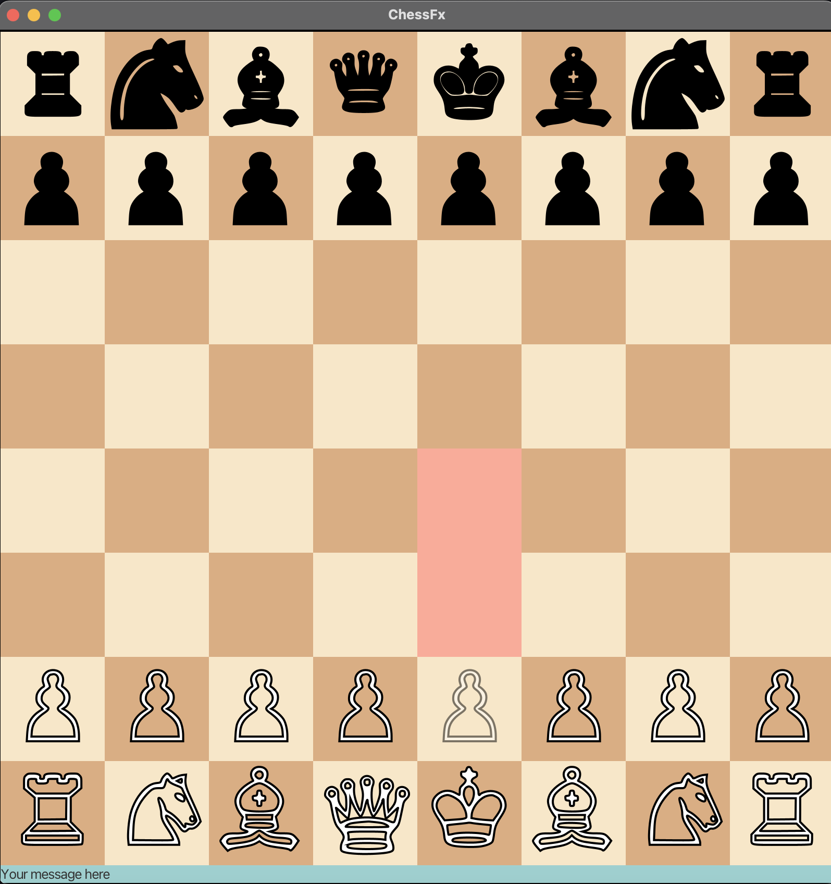

# ScalaFxChess

## Description

Local two player game of chess.

## User Guide

Make sure [SBT](https://www.scala-sbt.org/download/) and [scala 3](https://www.scala-lang.org/download/) are installed.

1. `cd` into ScalaFxChess
2. type `sbt` in terminal
3. type `run` in sbt command line

## Contributors

[alicecnm](https://github.com/alicecnm/)

[StanCDev](https://github.com/StanCDev/)
